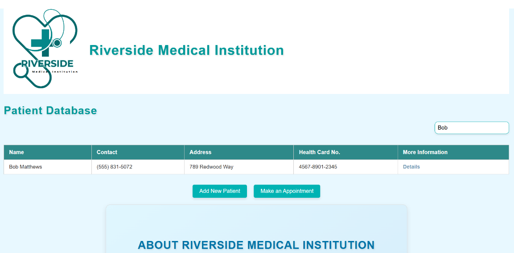

# Riverside Medical Institution Patient Portal Database
Fall 2024 Hackathon
## Description
The page stores patients in LocalStorage allows you to see all their health records details. We can update their folder or add a new patient. Lastly, the patient can make a new appointment with our Hospital, selecting a time, and date, which we can also edit or delete. This allows for better organization and neatness, providing crucial service to the village. 

[Go to Website here](https://an-m1.github.io/CTRL-HACK-DEL-Project/)
[Go to Devpost here](https://devpost.com/software/riverside-medical-institution-patient-portal-database?ref_content=user-portfolio&ref_feature=in_progress)

## Usage
This webpage was designed to help people in the village who have poor system management and can't keep records safe and organized. It allows trained future nurses, staff, receptionists, and data inspectors to keep track of everyone in the village regarding their health-related issues. This provides better care for everyone, updating their data if something changes in their health records, and making appointments with our many specialists available for any inquiries. 

## Credits
Ankit Modhera,
Ariana Vinamagua,
Parth Patel